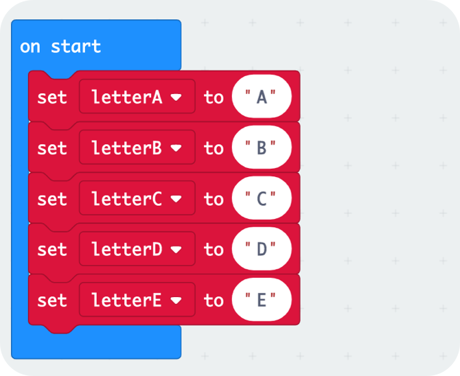
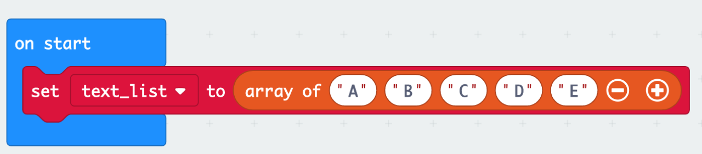
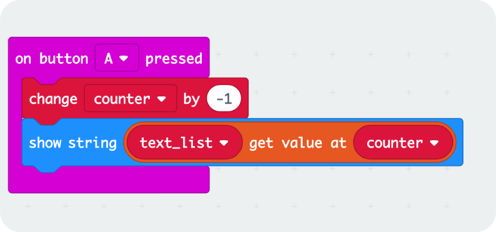
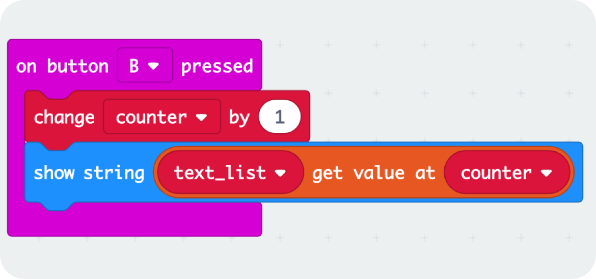
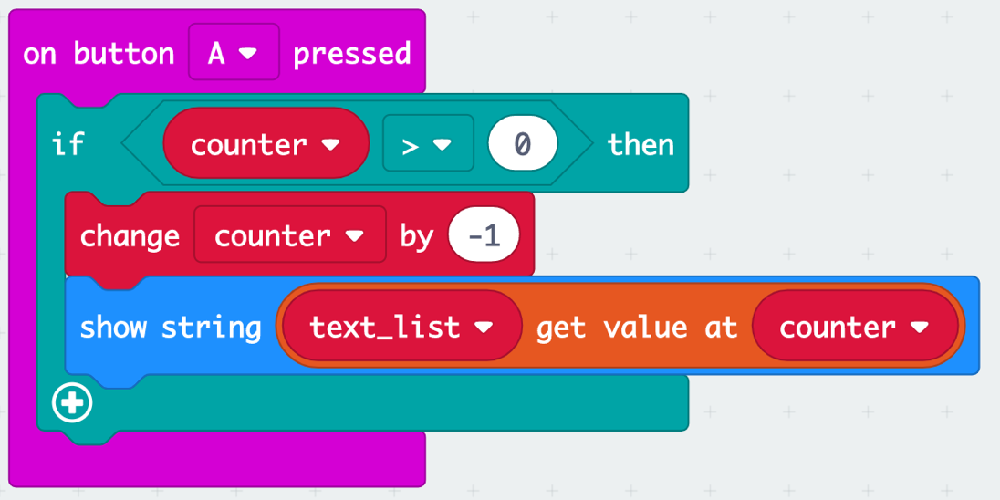

# Introduction to the micro:bit

## Get started
- Open https://makecode.microbit.org/
- Connect the micro:bit via USB
- LED on micro:bit turns orange
- Save the .hex file to "USB Drive"
- LED on micro:bit will blink yellow until the file has been transferred. 


## Show LEDs ♥


## Show icon


```
basic.showIcon(IconNames.Heart)
```

## Hello, World


```
basic.showString("Hello, World!")
```

## Forever


```
basic.forever(function () {
    basic.showIcon(IconNames.Heart)
    basic.showIcon(IconNames.SmallHeart)
})
```

## Shake


```
input.onGesture(Gesture.Shake, function () {
    basic.showIcon(IconNames.No)
})
basic.showIcon(IconNames.Heart)
```

## Buttons


```
input.onButtonPressed(Button.A, function () {
    basic.showString("A")
})
input.onButtonPressed(Button.B, function () {
    basic.showString("B")
})
```

## Counter (variable)


```
let i = 0 // Variable
input.onButtonPressed(Button.A, function () {
    i = 0 // Reset variable
})
input.onButtonPressed(Button.B, function () {
    i += 1 // Increment variable
})
basic.forever(function () {
    basic.showNumber(i)
})
```

## Dice (random number)


```
input.onGesture(Gesture.Shake, function () {
    basic.showNumber(Math.randomRange(1, 6))
})
```

Or with a variable


```
let result = 0
input.onGesture(Gesture.Shake, function () {
    result = Math.randomRange(1, 6)
    basic.showNumber(result)
})
```

## Rock, Paper, Scissors


```
let result = 0
input.onGesture(Gesture.Shake, function () {
    result = Math.randomRange(0, 2)
    if (result == 0) {
        basic.showIcon(IconNames.SmallSquare) // Rock
    } else if (result == 1) {
        basic.showIcon(IconNames.Square) // Paper
    } else { // result == 2
        basic.showIcon(IconNames.Scissors)
    }
})
```

Make two, see who wins.

## Radio Alert (Sender)


```
input.onGesture(Gesture.Shake, function () {
    radio.sendString("alert")
})
radio.setGroup(1)
```

Use a second Micro:bit running the receiver code below.

## Radio Alert (Receiver)


```
radio.onReceivedString(function (receivedString) {
    basic.showString(receivedString)
})
radio.setGroup(1)
```

Use a second Micro:bit running the sender code above.

Make sure to use the same <a href="https://makecode.microbit.org/reference/radio/set-group">group</a> for both.

## External Button (w/ 3V)
Connect an external button to Pin *2* and *3V*.


```
pins.onPulsed(DigitalPin.P2, PulseValue.High, function () {
    basic.showIcon(IconNames.Heart)
})
```

## External Button (w/ GND)
Connect an external button to Pin *2* and *GND*.


```
pins.onPulsed(DigitalPin.P2, PulseValue.Low, function () {
    basic.showIcon(IconNames.Heart)
})
pins.setPull(DigitalPin.P2, PinPullMode.PullUp)
```

## External Buzzer
Connect an external buzzer to Pin *0* and *GND*.


```
basic.forever(function () {
    pins.digitalWritePin(DigitalPin.P0, 1)
    basic.pause(500)
    pins.digitalWritePin(DigitalPin.P0, 0)
    basic.pause(500)
})
```

## List

- Imagen the letters "A" "B" "C" "D" "E" saved in 5 different variables like:
        
    - letterA = "A"
    - letterB = "B",
    - letterB = "C",
    - letterB = "D",
    - letterB = "E"
        


```

let letterA = "A"
let letterB = "B"
let letterC = "C"
let letterD = "D"
let letterE = "E"

```

- To have this in a more convenient way you can use a list. Where the letters are saved on a specific position.

   -  LetterList: [0] = "A" 
   -  LetterList: [1] = "B"
   -  LetterList: [2] = "C"
   -  LetterList: [3] = "D"
   -  LetterList: [4] = "E"
    

    
 
 ```
 
let text_list: string[] = []
text_list = ["A", "B", "C", "D", "E"]
 
 ```
 
- Try to implement the following behavior.
- Each time you press the "Button B" the next Letter will be shown.
- Each time you press the "Button A" the letter bevor will be shown.





 ```
 input.onButtonPressed(Button.A, function () {
    counter += -1
    basic.showString("" + text_list[counter])
 })
 
 input.onButtonPressed(Button.B, function () {
    counter += 1
    basic.showString("" + text_list[counter])
 })
 
 let text_list: string[] = []
 let counter = 0
 counter = -1
 text_list = ["A", "B", "C", "D", "E"]
 
 ```

- The problem is, that you can jump to positions, where nothing is stored by keeping "Button A" or  "Button B" pressed. 
- Try to implement the following behavior.
- When "Button B" is pressed the position can not go higher than the length of the list.
- When "Button A" is pressed the position can not go lower than the first position.




```
input.onButtonPressed(Button.B, function () {
    if (counter < text_list.length - 1) {
    counter += 1
    basic.showString("" + text_list[counter])
    }
})

input.onButtonPressed(Button.A, function () {
    if (counter > 0) {
    counter += -1
    basic.showString("" + text_list[counter])
    }
})

let counter = 0
counter = -1

let text_list: string[] = []
text_list = ["A", "B", "C", "D", "E"]
```

- Try to do the same for your name :-)


## More
- https://github.com/tamberg/microbit-ghoust
- https://makecode.microbit.org/projects
- https://makecode.microbit.org/docs
