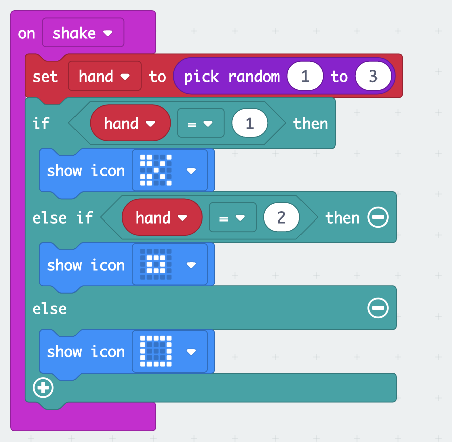

# Micro:bit introduction

## Get Started
- Open https://makecode.microbit.org/
- Connect the micro:bit via USB
- Save file to "USB Drive"

## <3
onstart
	showicon

## Hello, World
onstart
	show string

## Forever
forever
	showicon
	showicon

## Shake
on shake
	showicon

## Buttons
on button A pressed
	showstring A
on button B pressed
	showstring B

## Counter
counter (variable)
	on start
		n = 0
	forever
		show number n

## Dice
dice (random)
	on shake
		x = random()
	forever
		show number

## Rock, Paper, Scissors



```
let hand = 0
input.onGesture(Gesture.Shake, function () {
    hand = Math.randomRange(1, 3)
    if (hand == 1) {
        basic.showIcon(IconNames.Scissors)
    } else if (hand == 2) {
        basic.showIcon(IconNames.SmallSquare)
    } else {
        basic.showIcon(IconNames.Square)
    }
})
```

=> make two, see who wins

## Beep
sound
	how to connect the hardware
	on shake
		set pin

## Radio Alert
radio
	on shake
		send alarm
	on radio
		ring the alarm

## List
list
	?
## More
- See https://makecode.microbit.org/projects
