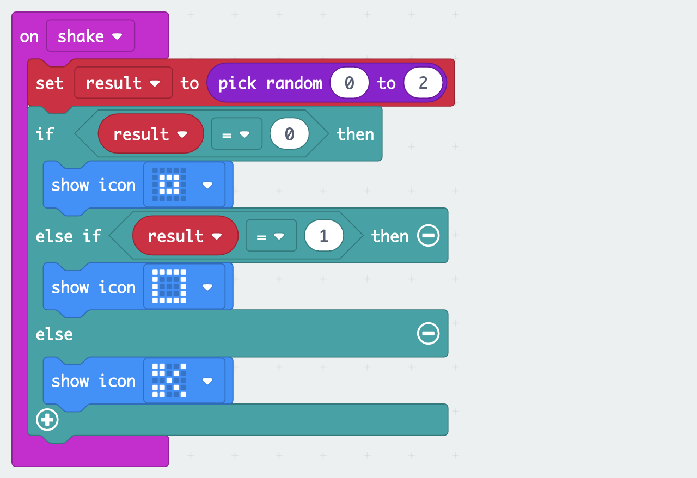

# Introduction to the micro:bit

## Get started
- Open the editor https://makecode.microbit.org/
- Connect the micro:bit to your computer via USB
- Download the .hex file to the "MICROBIT" drive
- Wait for the micro:bit's LED to stop blinking


## Show LEDs ♥


## Show icon


```
basic.showIcon(IconNames.Heart)
```

## Hello, World


```
basic.showString("Hello, World!")
```

## Forever


```
basic.forever(function () {
    basic.showIcon(IconNames.Heart)
    basic.showIcon(IconNames.SmallHeart)
})
```

## Shake


```
input.onGesture(Gesture.Shake, function () {
    basic.showIcon(IconNames.No)
})
basic.showIcon(IconNames.Heart)
```

## Buttons


```
input.onButtonPressed(Button.A, function () {
    basic.showString("A")
})
input.onButtonPressed(Button.B, function () {
    basic.showString("B")
})
```

## Counter (variable)


```
let i = 0 // Variable
input.onButtonPressed(Button.A, function () {
    i = 0 // Reset variable
})
input.onButtonPressed(Button.B, function () {
    i += 1 // Increment variable
})
basic.forever(function () {
    basic.showNumber(i)
})
```

## Dice (random number)


```
input.onGesture(Gesture.Shake, function () {
    basic.showNumber(Math.randomRange(1, 6))
})
```

Or with a variable


```
let result = 0
input.onGesture(Gesture.Shake, function () {
    result = Math.randomRange(1, 6)
    basic.showNumber(result)
})
```

## Rock, Paper, Scissors


```
let result = 0
input.onGesture(Gesture.Shake, function () {
    result = Math.randomRange(0, 2)
    if (result == 0) {
        basic.showIcon(IconNames.SmallSquare) // Rock
    } else if (result == 1) {
        basic.showIcon(IconNames.Square) // Paper
    } else { // result == 2
        basic.showIcon(IconNames.Scissors)
    }
})
```

Make two, see who wins.

## Radio Alert (Sender)


```
input.onGesture(Gesture.Shake, function () {
    radio.sendString("alert")
})
radio.setGroup(1)
```

Use a second micro:bit running the receiver code below.

## Radio Alert (Receiver)


```
radio.onReceivedString(function (receivedString) {
    basic.showString(receivedString)
})
radio.setGroup(1)
```

Use a second micro:bit running the sender code above.

Make sure to use the same <a href="https://makecode.microbit.org/reference/radio/set-group">group</a> for both.

## External Button (w/ 3V)
Connect an external button to Pin *2* and *3V*.


```
pins.onPulsed(DigitalPin.P2, PulseValue.High, function () {
    basic.showIcon(IconNames.Heart)
})
```

## External Button (w/ GND)
Connect an external button to Pin *2* and *GND*.


```
pins.onPulsed(DigitalPin.P2, PulseValue.Low, function () {
    basic.showIcon(IconNames.Heart)
})
pins.setPull(DigitalPin.P2, PinPullMode.PullUp)
```

## External Buzzer
Connect an external buzzer to Pin *0* and *GND*.


```
basic.forever(function () {
    pins.digitalWritePin(DigitalPin.P0, 1)
    basic.pause(500)
    pins.digitalWritePin(DigitalPin.P0, 0)
    basic.pause(500)
})
```

## Arrays
A simple way to store multiple values is one variable each.


```
let name0 = "Ada"
let name1 = "Alan"
let name2 = "Grace"
basic.forever(function () {
    basic.showString(name0)
    basic.showString(name1)
    basic.showString(name2)
})

```

A more compact way to store the same values is an array.

   

```
let names = ["Ada", "Alan", "Grace"]
basic.forever(function () {
    basic.showString(names[0])
    basic.showString(names[1])
    basic.showString(names[2])
}) 
```

Array values can be accessed at an index (here *0*, *1*, or *2*).

   

```
let names = ["Ada", "Alan", "Grace"]
basic.forever(function () {
    let index = Math.randomRange(0, 2)
    basic.showString(names[index])
})
```

## More
- https://github.com/tamberg/microbit-ghoust
- https://makecode.microbit.org/projects
- https://makecode.microbit.org/docs
