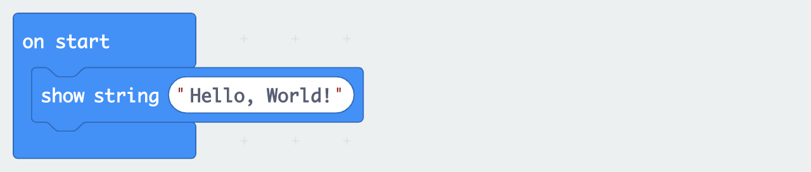
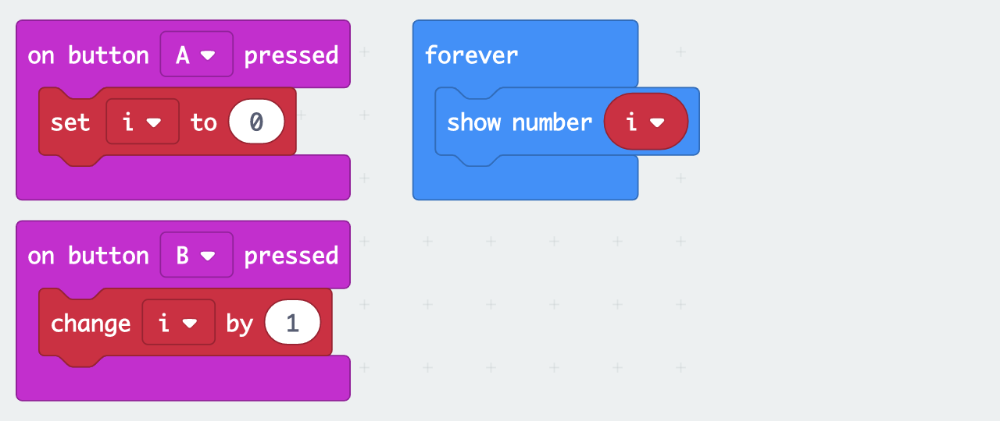

# Introduction to the micro:bit

## Get started
- Open https://makecode.microbit.org/
- Connect the micro:bit via USB
- LED on micro:bit turns orange
- Save the .hex file to "USB Drive"
- LED on micro:bit will blink yellow until the file has been transferred. 


## Show LEDs ♥


## Show icon


```
basic.showIcon(IconNames.Heart)
```

## Hello, World


```
basic.showString("Hello, World!")
```

## Forever


```
basic.forever(function () {
    basic.showIcon(IconNames.Heart)
    basic.showIcon(IconNames.SmallHeart)
})
```

## Shake


```
input.onGesture(Gesture.Shake, function () {
    basic.showIcon(IconNames.No)
})
basic.showIcon(IconNames.Heart)
```

## Buttons
on button A pressed
	showstring A
on button B pressed
	showstring B
	


## Counter (variable)




```
let i = 0 // Variable
input.onButtonPressed(Button.A, function () {
    i = 0 // Reset variable
})
input.onButtonPressed(Button.B, function () {
    i += 1 // Increment variable
})
basic.forever(function () {
    basic.showNumber(i)
})
```

## Dice (random number)


```
input.onGesture(Gesture.Shake, function () {
    basic.showNumber(Math.randomRange(1, 6))
})
```

Or with a variable


```
let result = 0
input.onGesture(Gesture.Shake, function () {
    result = Math.randomRange(1, 6)
    basic.showNumber(result)
})
```

## Rock, Paper, Scissors


```
let result = 0
input.onGesture(Gesture.Shake, function () {
    result = Math.randomRange(0, 2)
    if (result == 0) {
        basic.showIcon(IconNames.SmallSquare) // Rock
    } else if (result == 1) {
        basic.showIcon(IconNames.Square) // Paper
    } else { // result == 2
        basic.showIcon(IconNames.Scissors)
    }
})
```

=> make two, see who wins

## Beep
sound
	how to connect the hardware
	on shake
		set pin

## Radio Alert
radio
	on shake
		send alarm
	on radio
		ring the alarm

## List
list
	?
## More
- See https://makecode.microbit.org/projects
